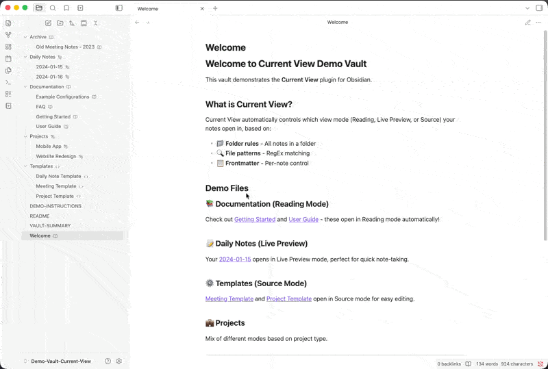
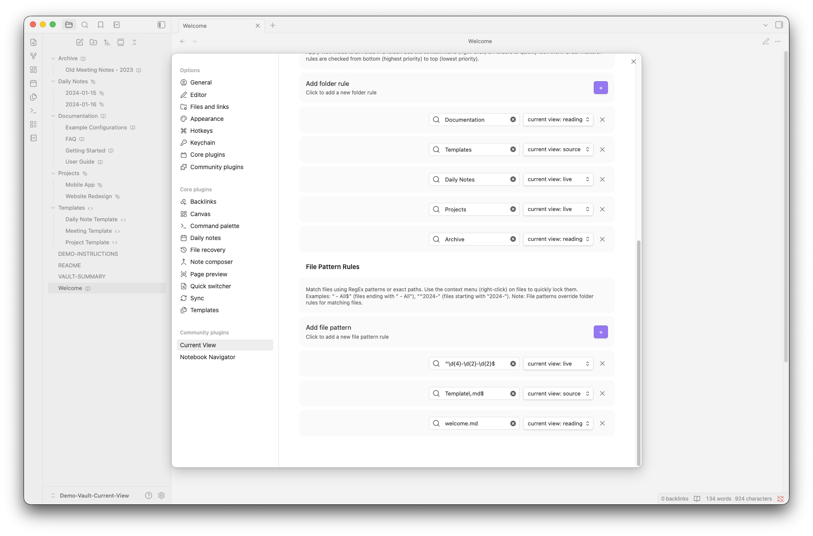
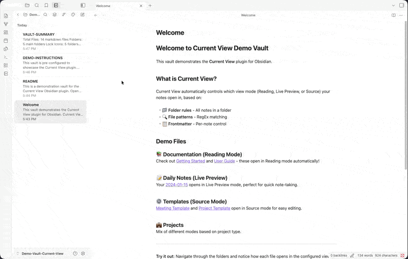
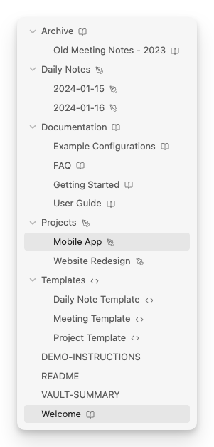
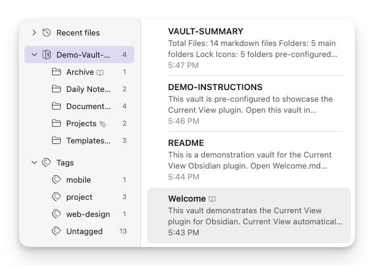
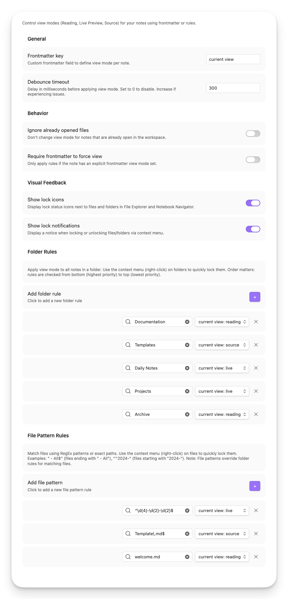

# Current View for Obsidian

<p align="center">
  <strong>Automatically control view modes (Reading, Live Preview, Source) for your notes based on smart rules and patterns.</strong>
</p>

<p align="center">
  <a href="https://github.com/LucEast/obsidian-current-view/releases">
    
  </a>
  <a href="https://github.com/LucEast/obsidian-current-view/releases">
    
  </a>
  <a href="https://github.com/LucEast/obsidian-current-view/actions">
    
  </a>
  <a href="https://github.com/LucEast/obsidian-current-view/blob/main/LICENSE">
    
  </a>
</p>

<!-- TODO: Add hero image/demo GIF here -->
<!-- <p align="center">
  
</p> -->

---

## ✨ Features

### 📖 Automatic View Mode Control
Automatically applies the right view mode when opening notes based on your rules:
- **Reading mode** for documentation and finished content
- **Live Preview** for active note-taking
- **Source mode** for templates and technical notes

<p align="center">
  
</p>

### 🎯 Flexible Rule System
Configure view modes based on:
- **📁 Folder paths** – All notes in `Templates/` open in Source mode
- **🔍 File patterns** – Match files using RegEx (e.g., all daily notes)
- **🏷️ Tag rules** – Match notes by Obsidian tags (e.g., all notes tagged `sent` open in Reading mode)
- **📋 Frontmatter** – Per-note control with custom metadata field

<p align="center">
  
</p>

### 🔒 Quick Lock from Context Menu
Right-click any file or folder in the File Explorer or [Notebook Navigator](https://github.com/johansan/notebook-navigator) to instantly lock it to a specific view mode.

<p align="center">
  
</p>

### 🏷️ Visual Lock Indicators
See at a glance which files and folders are locked with inline icon badges:
- 📖 **Book icon** – Locked to Reading mode
- 🖊️ **Pen icon** – Locked to Live Preview
- 💻 **Code icon** – Locked to Source mode

<p align="center">
  
  
</p>
<p align="center">
  <em>Lock icons in File Explorer (left) and Notebook Navigator (right)</em>
</p>

### 🔌 Notebook Navigator Integration
Full support for [Notebook Navigator](https://github.com/johansan/notebook-navigator) plugin:
- ✅ Context menu integration using official API (v1.2.0+)
- ✅ Lock icons in both navigation pane and file list
- ✅ Real-time updates when locking/unlocking

---

## 🧠 How It Works

### View Mode Priority

When you open a note, Current View checks for view mode rules in this order:

```
1. File Pattern Rules  →  Exact path match or RegEx pattern
2. Tag Rules           →  Any matching tag in frontmatter
3. Folder Rules        →  Deepest matching folder wins
4. Frontmatter         →  Per-note override
5. Obsidian Default    →  Your global Obsidian setting
```

<!-- TODO: Add diagram showing priority flow -->
<!-- <p align="center">
  
</p> -->

**Example:**
- You have a folder rule: `Templates/` → Source mode
- You open `Templates/meeting-note.md`
- The note has frontmatter: `current view: reading`
- **Result:** Opens in **Reading mode** (frontmatter wins)

**Example with tag rule:**
- You have a tag rule: `sent` → Reading mode
- You open a note with `tags: [sent]` in its frontmatter
- **Result:** Opens in **Reading mode** (tag rule applies automatically)

---

## 📑 Usage Examples

### Frontmatter Control

Add a frontmatter field to any note for per-note control:

```yaml
---
current view: reading     # Options: reading, source, live
---
```

You can customize the frontmatter key in plugin settings (e.g., change it to `view-mode` or `display`).

### Common Use Cases

**📚 Documentation vault:**
```yaml
# Lock all files in Docs/ to Reading mode
Folder: Docs/
Mode: reading
```

**🗓️ Daily notes:**
```yaml
# Match pattern like "2024-01-15.md"
Pattern: ^\d{4}-\d{2}-\d{2}\.md$
Mode: live
```

**⚙️ Templates:**
```yaml
# All templates open in Source mode for editing
Folder: Templates/
Mode: source
```

**📬 Published/sent notes:**
```yaml
# Notes tagged with 'sent' or 'published' open in Reading mode
Tag: sent
Mode: reading
```
Any note with `tags: [sent]` in its frontmatter will automatically open in Reading mode.

<!-- TODO: Add screenshot of common configurations -->
<!-- <p align="center">
  
</p> -->

---

## ⚙️ Settings

<p align="center">
  
</p>

### Core Settings

| Setting | Description | Default |
|---------|-------------|---------|
| **Frontmatter key** | Which frontmatter field to read for view mode | `current view` |
| **Debounce timeout** | Delay (ms) before applying view mode to prevent rapid switching | `0` |

### Behavior Options

| Setting | Description | Default |
|---------|-------------|---------|
| **Ignore opened files** | Don't change view mode for notes already open in workspace | `false` |
| **Ignore force view when not in frontmatter** | Only apply rules if frontmatter explicitly sets a view mode | `false` |

### Visual Feedback

| Setting | Description | Default |
|---------|-------------|---------|
| **Show explorer icons** | Display lock icons next to files/folders in File Explorer and Notebook Navigator | `true` |
| **Show lock notifications** | Show notice when locking/unlocking via context menu | `true` |

### Rules Configuration

- **Folder Rules**: Apply view mode to all notes in a folder (context menu locks write here)
- **Tag Rules**: Apply view mode to notes that have a specific tag
- **File Patterns**: RegEx patterns or exact file paths (context menu file locks write here)

---

## 📦 Installation

### From Obsidian Community Plugins (Recommended)

1. Open **Settings** → **Community Plugins** in Obsidian
2. Click **Browse** and search for **"Current View"**
3. Click **Install**, then **Enable**

### Via BRAT

Use BRAT only if you want to test beta builds before they are released in the Obsidian Community Plugins directory.

1. Install [BRAT](https://github.com/TfTHacker/obsidian42-brat) plugin
2. In BRAT settings, click **Add Beta Plugin**
3. Enter: `LucEast/obsidian-current-view`
4. In BRAT, choose the latest beta release (for example <!-- README_BETA_VERSION_EXAMPLE_START -->`1.5.0-beta.1`<!-- README_BETA_VERSION_EXAMPLE_END -->)
5. Enable the plugin in Community Plugins

### Beta Channel Notes

- Stable releases use plain versions like <!-- README_STABLE_VERSION_EXAMPLE_START -->`1.5.0`<!-- README_STABLE_VERSION_EXAMPLE_END --> and are distributed through the Obsidian Community Plugins directory.
- Beta releases use versions like <!-- README_BETA_VERSION_EXAMPLE_START -->`1.5.0-beta.1`<!-- README_BETA_VERSION_EXAMPLE_END --> and are distributed through GitHub Releases for BRAT testers.
- Obsidian does not fully support semantic version pre-release handling for community plugins. If you install <!-- README_BETA_VERSION_EXAMPLE_START -->`1.5.0-beta.1`<!-- README_BETA_VERSION_EXAMPLE_END --> via BRAT, Obsidian may not automatically switch you to the stable <!-- README_STABLE_VERSION_EXAMPLE_START -->`1.5.0`<!-- README_STABLE_VERSION_EXAMPLE_END --> release later.
- If you test beta builds, treat BRAT as a separate release channel.

### Return From Beta To Stable

If you want to leave the beta channel and go back to the normal Community Plugins release track:

1. Open BRAT and switch this plugin to the stable release if available there
2. Or uninstall the BRAT-managed beta version
3. Reinstall **Current View** from **Settings** → **Community Plugins**
4. Future stable updates should continue normally from the Community Plugins directory

### Manual Installation

1. Download the latest `main.js`, `manifest.json`, and `styles.css` from [Releases](https://github.com/LucEast/obsidian-current-view/releases)
2. Create folder: `<vault>/.obsidian/plugins/obsidian-current-view/`
3. Copy the downloaded files into this folder
4. Reload Obsidian and enable the plugin in **Settings** → **Community Plugins**

---

## 🔗 Compatibility

### Supported Plugins

- **[Notebook Navigator](https://github.com/johansan/notebook-navigator)** (v1.2.0+) – Full integration with context menus and lock icons
- **File Explorer** – Native Obsidian file explorer support

### Requirements

- Obsidian v1.0.0 or higher

---

## 🛠 Development

### Setup

```bash
git clone https://github.com/LucEast/obsidian-current-view.git
cd obsidian-current-view
npm install
```

### Build Commands

```bash
npm run dev          # Watch mode - auto-rebuild on changes
npm run build        # Production build
```

### Testing

```bash
npm run test         # Run unit tests once
npm run test:watch   # Watch mode during development
npm run coverage     # Generate V8 coverage report
```

### Architecture

See [CLAUDE.md](CLAUDE.md) for development guidelines and architecture overview.

---

## 🤝 Contributing

Contributions are welcome! Please feel free to submit a Pull Request.

1. Fork the repository
2. Create your feature branch (`git checkout -b feature/amazing-feature`)
3. Commit your changes using conventional commits (`git commit -m 'feat: add amazing feature'`)
4. Push to the branch (`git push origin feature/amazing-feature`)
5. Open a Pull Request

---

## 💡 Support

If you encounter issues or have feature requests:
- 🐛 [Report a bug](https://github.com/LucEast/obsidian-current-view/issues/new?template=bug_report.md)
- 💡 [Request a feature](https://github.com/LucEast/obsidian-current-view/issues/new?template=feature_request.md)
- 💬 [Start a discussion](https://github.com/LucEast/obsidian-current-view/discussions)

---

## 🙏 Acknowledgments

- Built for [Obsidian](https://obsidian.md)
- Integrated with [Notebook Navigator](https://github.com/johansan/notebook-navigator) by Johan Sanneblad
- Inspired by the Obsidian community's need for better view mode control

---

## 📝 License

[MIT](LICENSE) – Free to use and modify.
